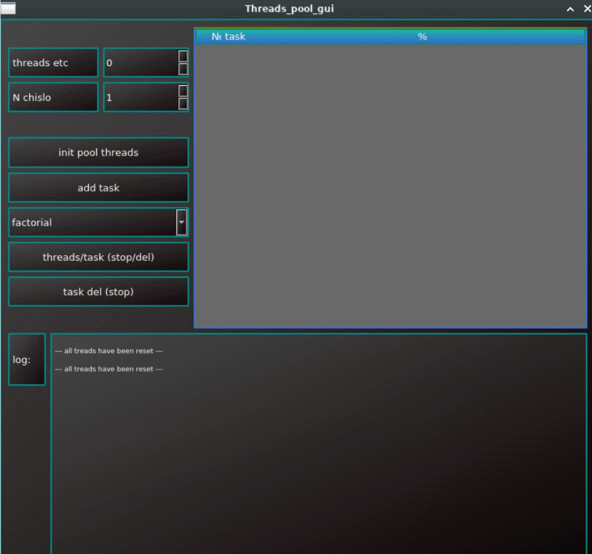

# v_v

Прогресс показан на gif, описание ниже  
Valgrind видит только 2 точки  утечки в интерфейсе, одна на очередь баров прогресса, вторая на очередь метки в таблице.  
Сам пул без них. Основная логика в ThreadPool.
- Реализовать класс для одновременного многопоточного выполнения произвольных задач, а также небольшое оконное приложение для проверки работоспособности получившегося решения.  
    Класс с названием  ThreadPool  должен соответствовать следующим характеристикам:   
    Обладать методом для добавления задачи. Задачей считаются объект класса Task.  
- Уметь  
    быть запущенным и остановленным после запуска в произвольный момент времени.  
    запуск стартует потоки, которые (очевидно) начинают выполнять задачи.  
    Остановка удаляет те задачи, выполнение которых ещё не началось, но не тормозит те, которые выполняются на момент остановки (потоки завершатся после того, как доделают свою текущую задачу).  
    Уметь управлять количеством потоков, которое задаётся до запуска пула.  
    Если задача предполагает получение результата, должен присутствовать способ его получения.  
- Оконное приложение  
    Должно быть реализовано диалоговое окно со следующими возможностями:  
    Должны быть кнопки “старт”, “стоп”, которые запускают и останавливают пул потоков  
    Должен быть способ задавать количество рабочих потоков  
    Должны быть способы ввести входные данные для задачи  
    Должен отображается лог работы потоков: старт, остановка, получение задачи, выполнение задачи.  
- Критерии реализации:  
    Valgrind не должен находить утечек памяти  
    Оформление (внешний вид) интерфейса принципиально никак не важно.  
    В качестве типовых задач можно использовать: вычисление факториала числа; вычисление N-ого числа Фибоначчи; вычисление двойного факториала числа  
    Задачи изначально добавляются в очередь и выполняются в том же порядке, в котором были добавлены.  
    Рабочие потоки после запуска циклично получают задачу из списка добавленных, выполняют её и после этого берутследующую. Если задачи закончились – спят, либо завершаются, на усмотрение реализующего.  
    Проект для QMake/CMake.  
    Проект должен быть разработан с использованием C++11 и Qt 5.  
    Не рекомендуется использовать QtConcurrent.  

---

