# -_-
###### 1:
a
На языке Python или C++ написать алгоритм (функцию) определения четности целого числа,
который будет аналогичен нижеприведенному по функциональности, но отличен по своей сути.
Объяснить плюсы и минусы обеих реализаций. 

Сами функции: [tsk1.py](tsk1.py)
количество команд по disasm выводятся и указаны в конце [tsk1.py](tsk1.py), что прямо коррелируется с временем  выполнения
#### Плюсы и минусы каждой реализации:
|   def   | description                                      | +                                                                                                                   | -                                                                                                                                                                                         |
|:-------:|--------------------------------------------------|---------------------------------------------------------------------------------------------------------------------|-------------------------------------------------------------------------------------------------------------------------------------------------------------------------------------------|
| isEven  | <%2> приведенный пример                          | краткая и простая реализация                                                                                        | может вызвать переполнение для очень больших чисел, операция деления                                                                                                                      |
| isEven1 | через итерируемую последовательность <range()>   | применим и в других системах исчисления с четным основанием если указывать шаг                                      | проходится по всем четным числам от 0 до указанного                                                                                                                                       |
| isEven2 | <&1> через побитовое логическое «И»              | оперирует только с нулевым битом исходного числа value в двоичной системе из-за чего скорость выполнения возрастает | нужно учитывать, что это операнд для битовой операции                                                                                                                                     |
| isEven3 | дубликат sEven2, но <operator.truth(value&1)>    | ⇑⇑⇑⇑⇑⇑⇑                                                                                                             | дублирование функции                                                                                                                                                                      |  
| isEven4 | через вычитание, рекурсия                        | при определенных задачах возможно уместна                                                                           | время работы алгоритма больше из-за рекурсии<br/>работает медленнее, так как большее колличество повторных шагов<br/>выше потребление памяти, проигрывает по колличеству объектов, без gc |
| isEven5 | проверяет, что число n оканчивается на 0 2 4 6 8 | не проводит вычисления<br/>вариант для комплексного числа, работает через строку                                    | как минимум пять операций сравнения                                                                                                                                                       |

###### even:

```mermaid
gantt
    dateFormat X
    axisFormat %s
    section isEven
        t - 800:0, 800
    section isEven1
        t - 3400:0, 3400
    section isEven2
        t - 1200:0, 1200
    section isEven3
        t - 2500:0, 2500  
    section isEven4
        over 7889600: 0, 3899
    section isEven5
        t - 3600: 0, 3600

```

###### odd:

```mermaid
gantt
    dateFormat X
    axisFormat %s
    section isEven
        t - 1100: 0, 1100
    section isEven1
        t - 2600: 0, 2600
    section isEven2
        t - 1400: 0, 1400
    section isEven3
        t - 2500: 0, 2500  
    section isEven4
        over 76458000: 0, 3299
    section isEven5
        t - 3100: 0, 3100
```

--------------------------
###### 2:
На языке Python или С++ написать минимум по 2 класса реализовывающих циклический буфер FIFO. Объяснить плюсы и минусы каждой реализации.
Оценивается: полнота и качество реализации, оформление кода, наличие сравнения и пояснения по быстродействию
--------------------------
Сами классы: [tsk2.py](tsk2.py)<br/> 
Так как python интерпретируемый язык то за счет скомпилированной библиотеки способ с deque() выходит вперед
#### Плюсы и минусы каждой реализации:
|      class       | description                                                  | +                                                                                                                                                                                                                                        | -                                                                                                                                                                                                                                       |
|:----------------:|--------------------------------------------------------------|------------------------------------------------------------------------------------------------------------------------------------------------------------------------------------------------------------------------------------------|-----------------------------------------------------------------------------------------------------------------------------------------------------------------------------------------------------------------------------------------|
| cyclebf_iter_lst | через итерируемую последовательность, с помощью списка Python| простота реализации кода за счет использования встроенной структуры данных, методы которой можно использовать для управления очередью.<br/>основа на итерируемой последовательности, значит есть непосредственный доступ к началу и концу| низкая производительность при удалении из начала списка, что не эффективно для больших очередей                                                                                                                                         |
|     cyclebf2     | с помощью deque() модуля collections                         | использование двусторонней очереди обеспечивает эффективное добавление и удаление элементов; popleft() имеет константную временную сложность<br/>указатели аккумуляторов формируются по мере их надобности, с корреляцией итераций       | зависимость от библиотеки                                                                                                                                                                                                               |
| cyclebf_one_lst  | с помощью связанного списка                                  | эффективность удаления элемента из начала списка за время О(1), т.к. нет необходимости перестраивать перемещать последовательность                                                                                                       | указатели аккумуляторов формируются по мере их надобности<br/>Сложность доступа к головному элементу или элементу удаления, для доступа необходимо пройти по всем предшествующим элементам<br/>Занимает больше памяти чем простой список|

###### Быстродействие на int(10000):
**заполнение:** 

```mermaid
gantt
    dateFormat X
    axisFormat %s
    section cyclebf2
        t - 0.009: 0, 9
    section cyclebf_iter_lst
        t - 0.011: 0, 11
    section cyclebf_one_lst
        t - 0.011: 0, 11
    section cyclebf_one_lst<br/>overflow
        overflow - 9.33: 0, 1000
```

**чистка:** 

```mermaid
gantt
    dateFormat X
    axisFormat %s
    section cyclebf2
        t - 0.007: 0, 7
    section cyclebf_iter_lst
        t - 0.08: 0, 80
    section cyclebf_one_lst
        t - 4,57 : 0, 1000
```

--------------------------
######  3:
На языке Python или С++ предложить алгоритм, который быстрее всего (по процессорным тикам) отсортирует
данный ей массив чисел. Массив может быть любого размера со случайным порядком чисел
(в том числе и отсортированным). Объяснить, почему вы считаете, что функция соответствует заданным критериям.
--------------------------
<br/>Общий алгоритм на python, который будет работать быстрее плохо представляется.
<br/>Некоторые быстрее с около отсортированными данными, некоторые с рандомными или искусственными.
Для небольших массивов разница между O(n) , O(n*logn) и O(n^2) будет практически незаметна, а сортировка расческой будет быстрее быстрой. Для уже отсортированных массивов неэффективные O(n^2) сортировки, такие как пузырьком, перемешиванием, вставками, окажутся более эффективными и, в случае с первыми двумя не затратными по памяти.
<br/>Быстрые сортировки дают в среднем асимптотику O(n log n), то справедливо как для merge, quick так и для tim сортировок, но они  уходят в крайности на отсортированных массивах данных.
<br/>Функция sortst -  list.sort() пользуются timsort в python, является гибридом, имеющим внутри  вставки и  слияния, а также  ряд дополнительных условий для оптимизации
<br/>Гибридные алгоритмы можно считать усреднениями по скорости с разными данными

<br/>**тест на двух последовательностях**
<br/> реализации: [tsk3.py](tsk3.py)
###### созданный из случайных чисел

```mermaid
gantt
    dateFormat X
    axisFormat %s
    section count_sort
        t - 0.484375: 0, 48.4375
    section quick_sort
        t - 2.04: 0, 204
    section merge_sort
        t - 7.29: 0, 729
    section heap_sort
        t - 8.75: 0, 875
    section q_a_h_sort
        t - 1.06: 0, 106
    section sortst<br/>(timsort в python)
        t - 0.078125: 0, 007.8125
    section bubble_sort
        over: 0, 899
```

###### отсортированный

```mermaid
gantt
    dateFormat X
    axisFormat %s
    section count_sort
        t - 0.4375: 0, 043.75
    section quick_sort
        t - 1.42: 0, 142
    section merge_sort
        t - 7.02: 0, 702
    section heap_sort
        t - 8.04: 0, 804
    section q_a_h_sort
        t - 1.03: 0, 103
    section sortst<br/>(timsort в python)
        t - 0.015625: 0, 001.5625
    section bubble_sort
        t - 0.09375: 0, 9
```

```
(0.484375, 'count_sort')
(0.4375, 'count_sort')
(2.046875, 'quick_sort')
(1.421875, 'quick_sort')
(7.296875, 'merge_sort')
(7.015625, 'merge_sort')
(8.75, 'heap_sort')
(8.046875, 'heap_sort')
(1.0625, 'q_a_h_sort')
(1.03125, 'q_a_h_sort')
(0.078125, 'sortst')
(0.015625, 'sortst')
(0.09375, 'bubble_sort')
```
Сортировка вставками гораздо быстрее эффективных многих сортировок
Быстрая из за центральных опор в отсортированном массиве проигрывает сортировке вставками.
Timsort имеет лучшие результаты, buble сортирует долго,  но при этом с уже отсортированным, для проверки работает быстро

Комбинированные методы показывают либо лучшие либо усредненные результаты
В частности Python  в любом случае самая оптимальная  реализация будет, та которая реализована как и Timsort
комбинированным способом и уже с скомпилированным методом  на языке строгой типизации